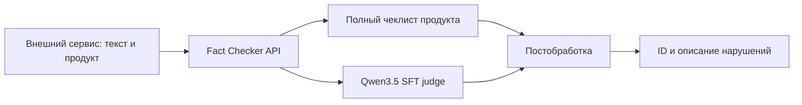

# Архитектура

## Граница сервиса

Сервис начинается с готового накопленного текста. Выбор продукта и сбор истории выполняются выше
по потоку; состояние диалога внутри fact-checker не хранится. Это позволяет повторить запрос,
горизонтально масштабировать API и однозначно связать результат с версией входного чеклиста.

ASR, proxy сессий, интерфейс корректирующей карточки и цикл обучения намеренно находятся вне
репозитория.

## Проверочный контур

1. API валидирует `product`, `text` и корреляционный идентификатор.
2. Каталог выбирает полный чеклист продукта. В prompt передаются только `question` и `answer`; ID
   модели не показываются.
3. Модель выполняет контекстную привязку, определяет тип ответа и сравнивает фактическое ядро с
   эталоном. Необсуждавшиеся пункты она не возвращает.
4. Парсер принимает JSON-массив. Поврежденный JSON восстанавливается консервативно и помечает
   ответ как `degraded`.
5. Вопрос должен дословно совпасть с записью исходного чеклиста. Только после совпадения код
   присваивает ID; выдуманные вопросы отбрасываются.
6. В ответ попадают элементы с `verdict=1`. Повторные ID дедуплицируются.

Таким образом, модель отвечает за семантическое решение, но не может выдумать действующий ID или
изменить источник истины.

## Состояние и параллелизм

API не хранит диалоговые сессии. Ограничение параллельных запросов к модели действует внутри
процесса (`FACT_CHECKER_MODEL_MAX_CONCURRENCY`). vLLM выполняется отдельным контейнером и может быть
заменен совместимым удаленным endpoint без изменения прикладного кода.

## Отказоустойчивость

- HTTP 429 и ошибки 5xx модельного backend повторяются с линейной задержкой.
- Недоступный backend дает HTTP 503, а не пустой список нарушений.
- Частично некорректная генерация дает `status=degraded` и машинно читаемые `warnings`.
- Неизвестный продукт дает HTTP 404; автоматический выбор похожего чеклиста не выполняется.
- Версия чеклиста включается в каждый успешный ответ.

